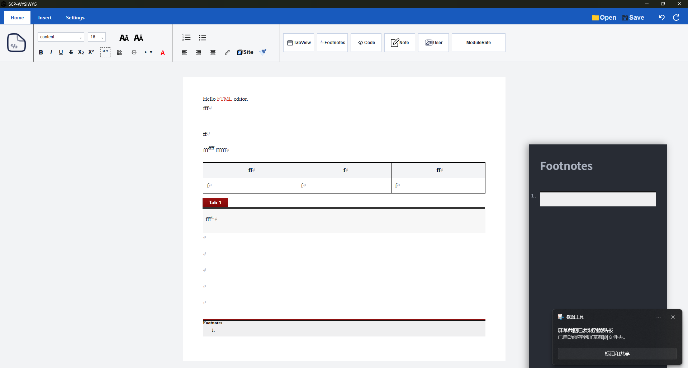

# Theme Injection — Abandoned

## TL;DR
Do **NOT** attempt in-editor Wikidot theme rendering unless you are
building a browser plugin.

## Why

Wikidot theme CSS is built on a 16-year-old YUI framework with no docs,
inconsistent naming, missing variables, and DOM structures that assume a
full live Wikidot page (header, sidebar, login status, action area...).

Replicating it inside a standalone ProseMirror editor means fighting:
- selectors that target elements the editor doesn't have
- `@import` chains pulling remote CSS
- `:root:has()` preset switching tied to YUI tab DOM
- layout `calc()` depending on header/footer heights that don't exist here

The cost/accuracy ratio is abysmal. The editor should use its own clean
styles; theme preview belongs in the exported, real page — not here.

## Verdict

Wikidot WYSIWYG is, and I quote, a son of a bitch designed fucking shit.

— and if a browser plugin isn't your route, never touch it.

---

## Author Post

When I was writing this, I was frustrated with the lack of documentation
and the inconsistent naming.

I know the SCP-Wiki authors tried their best to make it work, but it's
still a mess (for a WYSIWYG editor).

See? This image is a screenshot of the editor with only the page-content
theme injected. It looks beautiful — but the moment I put `
`
and `
` things into the editor, it crashed for no clear reason.

Fortunately, the ProseMirror-only version still works fine. I know I could
have done better on the CSS, but I don't have the time.

It's a shame I have to do this. Learning Wikidot's legacy CSS was a waste
of time. I'm a translator, not an author, so I never understood why it
would be worth learning Wikidot CSS in the first place.

If you want to build a truly beautiful page, HTML/CSS/JS is your best
option — and in Wikidot, `[[html]]` and `[[iframe]]` are welcome.

When Wikidot isn't good enough, GitHub Pages is your best option.

So I abandoned this part of the project.

I spent a ton of hours on this, and all it returned was an `abandoned`?
This shit is not worth it.

Time to move on, once I'm done with the simple `[[include]]` component
WYSIWYG tests and the user `[[span]]` component.

> Oh wasd243, maybe you should consider using a browser plugin.
> Or maybe you could just leave the in-editor theme rendering and the
> exporter as they are — sounds great, right? You don't need to handle
> all that Wikidot junk for the whole WYSIWYG rendering pipeline.

Well, I considered that. But everyone already knows the theme's
`[[include]]` wikitext — it's simple. So this is unnecessary, isn't it?

_I'm not a designer. I'm a developer._
_2026-06-18_
**_wasd243_** :-(